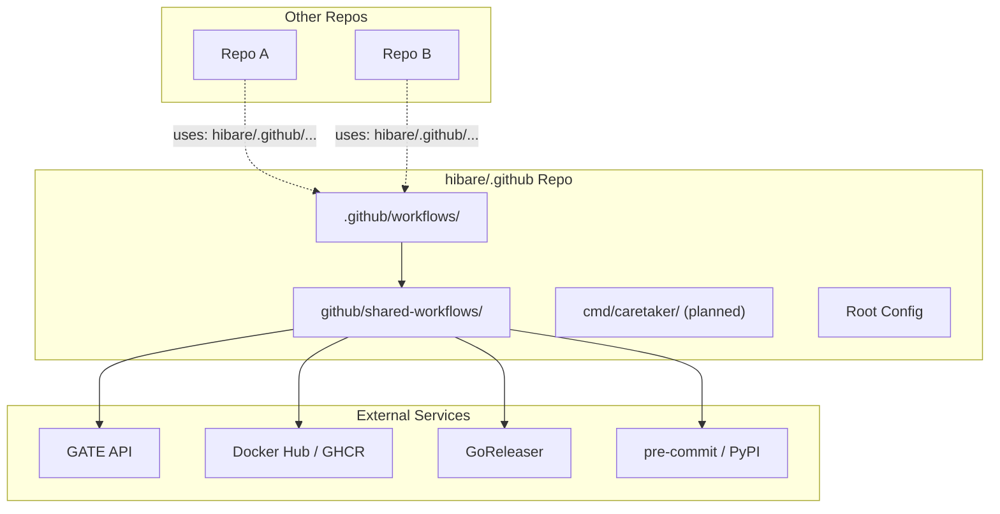

# Architecture

## Overview

This repository is a **GitHub Actions composite actions library** that provides reusable CI/CD workflows for the `hibare` organization. It also contains design documents for a planned Go CLI tool called `caretaker` for automated repository maintenance.

## High-Level Architecture



## Layers

### Layer 1: Consumer-Facing Workflows (`.github/workflows/`)

**Purpose**: Define CI/CD pipelines for this repository and serve as reference implementations.

| Workflow              | Triggers                          | Jobs                                 | Key Actions Used                                                             |
| --------------------- | --------------------------------- | ------------------------------------ | ---------------------------------------------------------------------------- |
| `checks.yml`          | Push to main/tags, PR to main/dev | `pre-commit`                         | `hibare/.github/github/shared-workflows/pre-commit@<sha>`                    |
| `release-drafter.yml` | Push to main, PR opened/synced    | `update_release_draft`, `auto_label` | `release-drafter/release-drafter@<sha>`, `step-security/harden-runner@<sha>` |

**Patterns**:

- Minimal permissions (`contents: read` by default, elevated per-job)
- Concurrency control with `cancel-in-progress: true`
- Security hardening via `step-security/harden-runner` in audit mode
- Pinned action SHAs for supply chain security

### Layer 2: Shared Composite Actions (`github/shared-workflows/`)

**Purpose**: Reusable, versioned CI building blocks consumed by other repositories via `uses: hibare/.github/github/shared-workflows/<name>@<ref>`.

Each action is a **composite action** (`runs.using: composite`) containing multiple steps.

#### Gate Action (`gate/action.yml`)

- **Purpose**: Exchange GitHub OIDC token for short-lived GitHub App installation token via GATE server
- **Pattern**: Three-step composite — fetch OIDC → build payload → exchange token
- **Security**: Masks OIDC token, validates inputs, fails fast on missing OIDC
- **External dependency**: GATE server (`gate-server-url` input)

#### Docker Image Build & Publish (`docker-image-build-publish/action.yml`)

- **Purpose**: Multi-platform Docker image build with caching, metadata, and multi-registry push
- **Pattern**: Prechecks → input normalization → Docker meta → QEMU → Buildx → cache → login → build/push
- **External dependencies**: Docker Hub, GHCR, docker/metadata-action, docker/setup-qemu-action, docker/setup-buildx-action, docker/build-push-action, actions/cache

#### GoReleaser (`goreleaser/action.yml`)

- **Purpose**: Build and publish Go binaries/archives with optional cosign signing
- **Pattern**: Checkout (fetch-depth: 0) → Setup Go (via go.mod) → Optional cosign → GoReleaser
- **External dependencies**: GoReleaser, cosign, Fury (optional)

#### Pre-commit (`pre-commit/action.yml`)

- **Purpose**: Run pre-commit hooks with pip cache
- **Pattern**: Install deps (with hashes) → Cache → Run hooks
- **External dependencies**: PyPI (pre-commit packages), actions/cache

### Layer 3: Configuration & Policy (Root)

- `.pre-commit-config.yaml` — Hook definitions pinned to commit SHAs
- `.github/dependabot.yml` — Monthly grouped updates for GitHub Actions across 5 directories
- `.github/release-drafter.yml` — Release categorization and auto-labeling rules
- `.editorconfig` — Cross-editor formatting standards

### Layer 4: Planned — Caretaker Go CLI (`cmd/caretaker/`) [NOT IMPLEMENTED]

Per design docs (`docs/plans/2026-06-04-caretaker-design.md`):

```text
cmd/caretaker/
├── main.go
├── cmd/
│   ├── root.go
│   └── precommit/
│       └── pin.go
└── internal/
    ├── precommit/
    │   ├── config.go      # Parse .pre-commit-config.yaml (yaml.Node for positions)
    │   ├── resolver.go    # Resolve tag → SHA via GitHub API
    │   └── pinner.go      # Orchestrate: clone → parse → resolve → edit → PR
    └── github/
        ├── client.go      # GitHub API wrapper
        └── repo.go        # Clone, push, create PR (go-git + go-github)
```

**Data Flow (Planned)**:

1. Parse CLI args → validate repo URL, read token
2. Shallow clone target repo (go-git, HTTPS + token)
3. Parse `.pre-commit-config.yaml` → identify tag revs (not SHAs)
4. For each tag: `GET /repos/{owner}/{repo}/git/ref/tags/{tag}` → resolve annotated tag → commit SHA
5. Edit raw YAML lines: replace `rev: vX.Y.Z` with `rev: <sha> # vX.Y.Z`
6. If changes: create branch → commit → push → create PR
7. Dry-run mode: print diff, skip git ops

## Data Flow Examples

### CI Workflow Execution (`checks.yml`)

```text
Push/PR → GitHub Actions
  → checks.yml (concurrency: cancel-in-progress)
    → Job: pre-commit (ubuntu-latest)
      → Checkout (actions/checkout@sha)
      → Setup Python (actions/setup-python@sha)
      → Run pre-commit composite action
        → Install pre-commit (pip install -r requirements.txt with hashes)
        → Cache ~/.cache/pre-commit (key: python + .pre-commit-config.yaml + requirements.txt hash)
        → pre-commit run --show-diff-on-failure --color=always
```

### Gate Token Exchange (`gate/action.yml`)

```text
Workflow with id-token: write
  → uses: hibare/.github/github/shared-workflows/gate@sha
    → Step 1: Fetch OIDC token
       curl $ACTIONS_ID_TOKEN_REQUEST_URL&audience=gate
       -H "Authorization: bearer $ACTIONS_ID_TOKEN_REQUEST_TOKEN"
       → Mask token, output to GITHUB_OUTPUT
    → Step 2: Build JSON payload
       { oidc_token, target_repository, policy_name?, requested_permissions?, requested_ttl? }
    → Step 3: POST to GATE server
       $GATE_SERVER_URL/api/v1/exchange
       → On 2xx: output token, expires_at, matched_policy, permissions, request_id
       → On error: ::error:: and exit 1
```

### Docker Build (`docker-image-build-publish/action.yml`)

```text
Inputs: image_names, tags, platforms, push_dockerhub, push_ghcr, build_args
  → Prechecks (validate required secrets for selected registries)
  → Normalize space-separated inputs to newlines (github-script)
  → docker/metadata-action (generate tags/labels from git refs)
  → docker/setup-qemu-action (multi-arch)
  → docker/setup-buildx-action
  → actions/cache (/tmp/.buildx-cache)
  → docker/login-action (Docker Hub if push_dockerhub)
  → docker/login-action (GHCR if push_ghcr)
  → docker/build-push-action
       platforms, push, tags, cache-from, cache-to, build-args
  → Output image digest
```

## Patterns & Conventions

### Composite Action Design

- **All shared workflows use `runs.using: composite`** — no Docker containers, runs directly on runner
- **Inputs explicitly typed** with descriptions, required/optional, defaults
- **Outputs mapped from step outputs** via `${{ steps.<id>.outputs.<name> }}`
- **Shell: bash with `set -euo pipefail`** for fail-fast behavior
- **Environment variables passed explicitly** via `env:` blocks (not global)

### Security Hardening

- **All external actions pinned to full SHA** (not tags)
- **Minimal permissions** — workflow default `contents: read`, jobs elevate as needed
- **OIDC token audience restricted** (`audience=gate`)
- **Secrets never logged** — `::add-mask::` for tokens
- **Step-security/harden-runner in audit mode** — monitors egress

### Dependency Management

- **Dependabot grouped updates** — all GitHub Actions updates in one PR monthly
- **Pre-commit deps pinned with hashes** — `requirements.txt` generated from `requirements.in` via `pip compile --generate-hashes`
- **GoReleaser uses `go-version-file: go.mod`** — version controlled by repo

### Versioning & Release

- **Release Drafter** — auto-generates release notes from PR labels
- **Auto-labeler** — labels PRs based on branch name (`feat/`, `fix/`, `docs/`, `chore/`) and conventional commit titles
- **Version resolver** — major/minor/patch from labels, default minor
- **Tag template**: `v$RESOLVED_VERSION`

## Integration Points

| Component                    | Integrates With            | Protocol                  |
| ---------------------------- | -------------------------- | ------------------------- |
| `gate` action                | GATE server                | HTTPS REST (JSON)         |
| `docker-image-build-publish` | Docker Hub, GHCR           | Docker Registry API v2    |
| `goreleaser`                 | GoReleaser, cosign, Fury   | CLI / Go modules          |
| `pre-commit`                 | PyPI (pre-commit packages) | pip                       |
| `checks.yml`                 | Shared pre-commit action   | GitHub Actions `uses:`    |
| `release-drafter.yml`        | GitHub Releases API        | GitHub REST API           |
| Planned `caretaker`          | GitHub API, git repos      | HTTPS (go-github, go-git) |
